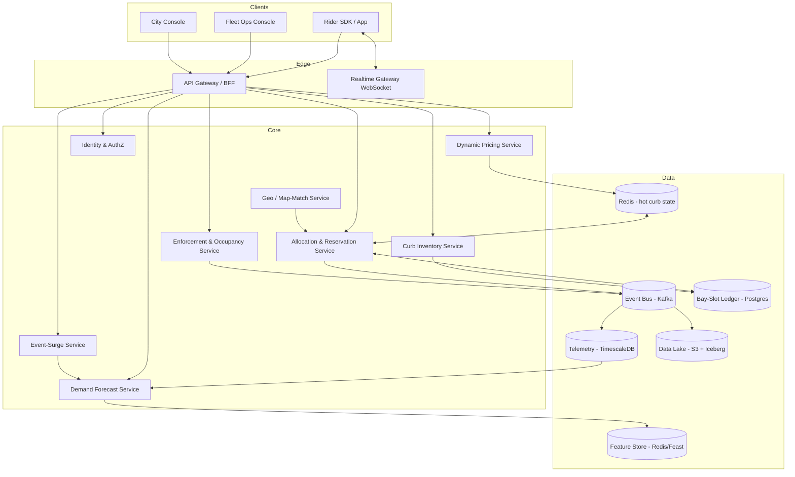
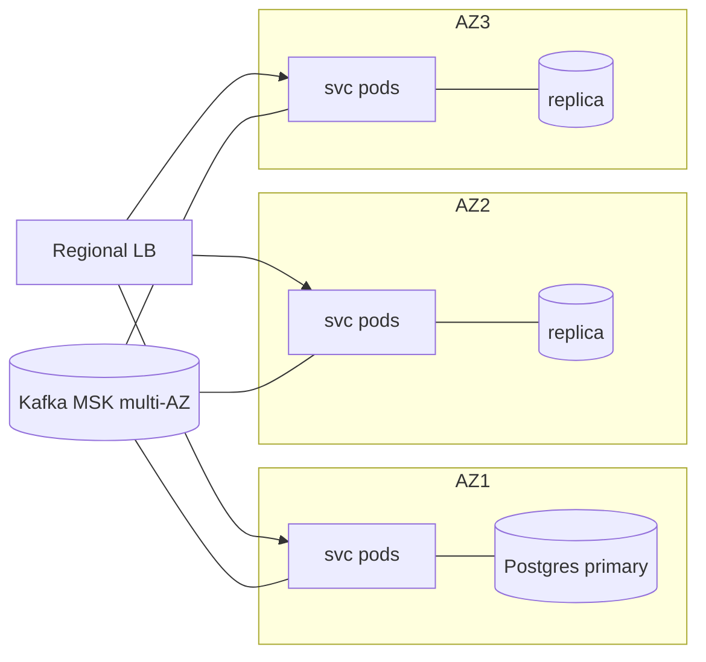
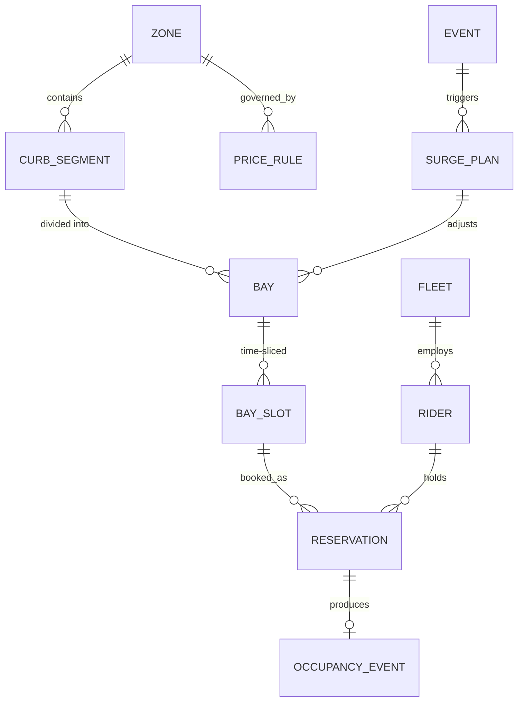

# CurbOS — Dynamic Curb & Loading-Zone Orchestration Platform
### Complete Project Dossier & Software Requirements Specification (SRS)

**Submission theme:** Poor Visibility on Parking-Induced Congestion
**Hackathon:** Flipkart Gridlock Hackathon 2.0 — Round 2
**Document class:** Production-grade SRS (reverse-engineered for Fortune-500 deployment)
**Version:** 1.0

---

## PROJECT STATEMENT (locked)

> **The curb is the most contested, least managed asset in the urban delivery economy.**
>
> In the quick-commerce era, the fastest-growing use of the kerb is the *short-dwell delivery stop* — a Flipkart/Ekart, Blinkit, Swiggy, or Amazon rider pulling over for 60–180 seconds to complete a drop. Because no city has designated, priced, or allocatable curb space for these stops, riders **double-park in live traffic lanes**. This single behaviour is simultaneously (a) a top, measurable source of parking-induced congestion that the Bengaluru Traffic Police must manage, and (b) a direct, recurring cost on every last-mile delivery P&L, because last-mile is 40–55% of total shipping cost and ~80% of that is the rider's *time*.
>
> **CurbOS** treats the curb as a dynamically-priced, demand-forecasted, allocatable resource — "OpenTable for the kerb." It forecasts where and when short-dwell delivery demand will cluster, carves the curb into time-sliced micro loading-bays, and routes each rider to the nearest free slot in real time. It exposes the same supply as (1) a curb-productivity SaaS to logistics fleets and (2) a curb-pricing/enforcement platform to the city. A bolt-on **Event-Surge** module pre-positions curb capacity around predictable congestion events (RCB matches, concerts, rallies, rain) and translates avoided lane-blocking into a defensible rupee figure.

The design choice that governs this entire document: **Curb-as-a-Service is the spine; Event-Surge is one feature on that spine, not a second system.** This keeps the demo single-threaded and the architecture coherent.

---

# SECTION 1 — EXECUTIVE SUMMARY

### Problem Overview
Urban delivery has exploded but the physical interface where a delivery is completed — the curb — has not been digitised, priced, or managed. A rider arriving at a destination has three bad options: circle for a legal spot (burns rider-minutes), double-park in a moving lane (creates congestion and fine risk), or park far and walk (lengthens the drop). All three destroy money for the fleet and capacity for the road. The root cause is *invisibility*: no party — not the city, not the fleet — has a live model of curb supply versus short-dwell delivery demand.

### Industry Context
Bengaluru's congestion is estimated to cost roughly ₹20,000 crore annually in wasted time, fuel and lost productivity, and it ranks among the slowest cities globally in the TomTom Traffic Index 2025. The Outer Ring Road corridor alone has been pegged at over $15 billion in annual lost revenue by an industry association. On the logistics side, last-mile runs 40–55% of total shipping cost; in India roughly 60% of per-shipment cost is last-mile, of which ~80% is the delivery agent's time and fuel. **Rider-minutes are the unit of money.** Quick-commerce (Blinkit, Zepto, Swiggy Instamart) has multiplied the *frequency* of short-dwell stops by an order of magnitude, turning a marginal nuisance into a structural congestion source.

### Existing Solutions
1. **Consumer parking apps** (Park+, Get My Parking) — report occupancy of *known long-dwell lots*.
2. **Navigation ETAs** (Google/HERE/TomTom) — predict travel time, not curb availability.
3. **Fleet routing/dispatch** (in-house Ekart, Locus, FarEye) — optimise the *sequence* of stops, but treat the final 50 metres as a black box.
4. **Municipal enforcement** — reactive ticketing of double-parking after the fact.

### Gaps in Existing Solutions
- **No demand model for short-dwell stops.** Parking tech models cars staying hours; nobody models the 90-second delivery stop.
- **No allocatable curb supply.** Curb geometry is not digitised as bookable inventory anywhere in India.
- **No pricing/closed loop.** Even where occupancy is known, there is no mechanism to route a specific rider to a specific free slot.
- **No shared substrate.** Fleets and cities both suffer the same problem but have no shared system; each optimises blind to the other.

### Why Current Approaches Fail
They optimise the wrong object. Routing engines minimise inter-stop travel assuming the stop itself is free and instantaneous; in dense cores the *last 50 m* (circling + double-park hunting + walk) is often the largest single variable in drop time and is entirely unmodelled. Parking apps optimise long-dwell occupancy, a different distribution (hours vs minutes, predictable vs bursty). Enforcement is lagging and adversarial — it taxes the symptom without creating supply.

### Opportunity Analysis
The curb is an unpriced, contested, common-pool resource — the textbook setup for a coordination platform that captures value for *both* sides. Because the same data substrate (a live curb supply/demand model) serves logistics ROI and civic congestion reduction, CurbOS sits in the rare top-right quadrant of *commercial ROI × civic impact*. The competitive moat is the substrate itself: once curb geometry + demand history + fleet integrations exist for a city, a competitor must rebuild all three.

### Proposed Solution
A four-plane platform:
1. **Curb Inventory Plane** — digitised, time-sliceable curb segments as bookable bays.
2. **Demand Forecasting Plane** — spatiotemporal model of short-dwell stop demand driven by order/dispatch density.
3. **Allocation & Routing Plane** — a real-time optimiser that assigns riders to the nearest free bay-slot and dynamically prices contested curb.
4. **Event-Surge Plane (feature)** — pre-positions curb capacity around forecast congestion events and reports avoided lane-blocking and rupees protected.

Consumed via a **Rider SDK/app**, a **Fleet Ops console**, and a **City console**.

### Expected Business Impact
- **Fleet (per city, recurring):** saving ~60 s/stop × ~30 drops/day × ~10,000 relevant riders ≈ ~5,000 rider-hours/day; at a loaded ₹120/rider-hour ≈ ₹6 lakh/day → **~₹18–22 crore/year per city**, plus fewer failed drops (each up to ~₹1,700) and fewer fines.
- **City (per city):** measurable reduction in lane-blocking minutes on commercial/residential corridors; a new, fair curb-pricing revenue line (BTP already collects ₹200+ crore/year in fines, so monetising road-use is an understood model).
- **Event-Surge:** episodic "₹X protected during the RCB match" demonstrations on top of the continuous baseline.

### Quantifiable Success Metrics
| Metric | Baseline | Target |
|---|---|---|
| Lane-block minutes per managed street / day | measured | −70% |
| Mean curb-acquisition time per stop | ~90 s | <20 s |
| Rider drops/day on managed corridors | n | +2–3 |
| Failed-delivery rate (curb-attributable) | measured | −40% |
| Bay utilisation (allocated / capacity) | — | 65–85% |
| Allocation latency (request→assignment) | — | p95 < 400 ms |
| Forecast skill (sMAPE, 30-min demand) | — | < 25% |

---

# SECTION 2 — DOMAIN RESEARCH (first-principles)

**Industry workflows.** A drop is: dispatch → travel → *arrival manoeuvre* → handoff → depart. Routing software optimises travel and assumes the arrival manoeuvre is zero-cost. In dense cores it is the dominant, variable, unmodelled cost. The platform must instrument and optimise the arrival manoeuvre specifically.

**User behaviour (riders).** Riders are paid per-drop or per-hour and are loss-averse to time. They will double-park rationally: the expected fine cost is far below the certain time cost of circling. **Implication:** enforcement alone cannot win; you must make the legal option *faster* than the illegal one. CurbOS does exactly this — a guaranteed nearby slot is faster than circling, so compliance becomes the rider's self-interest. This is the non-obvious lever: **align incentives, don't police them.**

**Operational bottlenecks.** (1) Curb demand is bursty and hyper-local (meal peaks, q-commerce 10-min windows). (2) Supply is fixed and shared across competing fleets and private vehicles. (3) The contested window is short (minutes), so any system with >1-minute latency or stale state is useless. This forces an event-driven, low-latency design, not a batch dashboard.

**Business constraints.** Fleets will not share raw order data (competitive). The platform must run on *privacy-preserving demand signals* (aggregated density, k-anonymised) and synthetic-but-realistic data for the MVP. Cities cannot deploy hardware sensors at scale quickly; the system must work from existing signals (dispatch density, optional single CCTV, manual digitisation) before any sensor rollout.

**Regulatory considerations.** Curb is public right-of-way; pricing/allocation by a private platform requires a municipal concession. Personal data of riders (location) triggers India's DPDP Act 2023 — purpose limitation, consent, data minimisation, and localisation of personal data. Dynamic pricing of public space invites fairness/equity scrutiny (must not exclude essential services, must be transparent and appealable).

**Enterprise adoption barriers.** (1) Cold-start: no value to fleet A until curb supply exists; no value to city until fleets participate. Solved by seeding one micro-zone end-to-end and demonstrating single-fleet value first (the fleet benefits even before the city formalises pricing). (2) Integration friction: fleets won't rebuild dispatch; CurbOS must be a thin SDK that sits beside existing routing. (3) Trust: cities need auditable, explainable pricing and an enforcement story.

**Non-obvious insights / ignored opportunities.**
- *The curb is the cheapest congestion lever in the city.* Signal retiming and road widening are slow and capital-heavy; reallocating curb time-slices is a software change.
- *Delivery vehicles are a controllable fleet*, unlike private cars — so a platform that controls even 20% of curb demand (the delivery share) can de-congest a street that private-car interventions can't touch. Competitors chasing private-car parking ignore the one demand segment that is *addressable by software*.
- *Curb demand forecasting is easier than traffic forecasting* because it is driven by order data, which is far more predictive of stops than aggregate flow is of congestion.

---

# SECTION 3 — STAKEHOLDER ANALYSIS

| Stakeholder | Goals | Frustrations | KPIs | Daily workflow | Success criteria |
|---|---|---|---|---|---|
| **Delivery rider (primary)** | Finish drops fast, avoid fines | Circling, double-park anxiety, walk distance | Drops/hr, idle min | Receive route → arrive → find curb → drop | Guaranteed nearby slot, less circling |
| **Fleet ops manager (primary buyer)** | Drops/rider up, SLA breaches down | Last-50m is a black box; can't measure curb loss | Cost/drop, on-time %, failed-drop % | Monitor live fleet, firefight breaches | Measurable rider-minutes recovered |
| **City / BTP officer (primary buyer)** | Less lane-blocking, fair enforcement, revenue | Reactive ticketing, no curb data | Lane-block min/corridor, complaints, revenue | Patrol, ticket, respond to jams | Corridor congestion down, defensible pricing |
| **Curb/parking operator (secondary)** | Monetise idle curb | Curb is un-inventoried | Yield/curb-metre | — | New revenue line |
| **Commercial property / mall (secondary)** | Less spillover at frontage | Delivery chaos at entrance | Frontage flow | — | Smooth delivery frontage |
| **Platform admin (internal)** | Uptime, correctness, fairness | Stale state, abuse | SLOs, allocation fairness | Configure zones, monitor models | SLOs met, no allocation abuse |
| **Data/ML engineer (internal)** | Forecast skill, low latency | Sparse ground truth | sMAPE, p95 latency | Train, eval, deploy models | Models in SLO, drift-monitored |
| **Compliance/legal** | DPDP & concession compliance | Location data risk, pricing fairness | Audit pass rate | Review DPAs, audits | Zero violations, auditable pricing |

---

# SECTION 4 — PRODUCT REQUIREMENTS DOCUMENT (PRD)

**Product vision.** Every delivery stop in India lands in a known, free, fairly-priced curb slot — so streets flow and fleets stop paying for circling.

**Product mission.** Turn the curb from an invisible, contested commons into a live, allocatable, dual-buyer marketplace.

**Product objectives.**
1. Cut rider curb-acquisition time on managed corridors to <20 s.
2. Cut lane-block minutes on managed corridors by ≥70%.
3. Recover ≥2 drops/rider/day on managed corridors.
4. Provide cities a transparent, auditable curb-pricing and enforcement substrate.
5. Protect quantified rupees during forecast congestion events (Event-Surge).

**User stories (abridged, with acceptance criteria).**

- *As a rider*, when I'm assigned a drop, I want the nearest free curb bay reserved for my arrival window so I don't circle.
  - **AC:** Given an active assignment within a managed zone, the rider app shows a reserved bay with walking distance ≤120 m and a hold of ≥4 min; reservation auto-releases if not occupied within the hold or after departure.
- *As a fleet ops manager*, I want to see curb-attributable time loss per zone vs a no-allocation baseline.
  - **AC:** Console shows lane-block minutes and mean acquisition time, allocation ON vs OFF, for any zone/date range, exportable.
- *As a city officer*, I want dynamic curb prices and an enforcement feed for bays misused.
  - **AC:** Price per bay-slot is computed from live utilisation, is logged immutably, and an over-dwell/unauthorised-use event is emitted within 30 s.
- *As an ops manager during an event*, I want curb capacity pre-positioned and a "₹ protected" figure.
  - **AC:** Given a registered event, Event-Surge increases allocatable bays in the impact radius from T−Δ and reports avoided lane-block minutes × loaded cost.

**User journeys.**
1. **Rider happy path:** assignment → bay reserved (push) → turn-by-turn to bay → arrive → "occupy" auto-detected (geofence/CV) → drop → "depart" → bay released → next.
2. **Contention path:** no free bay → optimiser offers (a) nearest bay with short queue ETA, or (b) dynamic-priced premium bay; rider chooses; fleet policy may auto-accept.
3. **Event path:** event ingested → impact radius + timeline forecast → surge bays provisioned → riders in radius get priority allocation → post-event report.

**Edge cases.** Bay physically blocked by a non-platform vehicle (rider reports → bay quarantined, reallocation); GPS drift in urban canyon (snap-to-segment + CV fallback); rider cancels mid-route (instant release); simultaneous requests for last bay (atomic reservation, see §8); zone with zero digitised curb (degrade to advisory mode, no guarantee).

**Failure cases.** Forecast service down → fall back to last-known + uniform priors, mark guarantees "best-effort"; allocation service down → riders get advisory "likely free" bays, no reservation; pricing service down → freeze price at last value, never block a drop; full outage → app degrades to plain navigation (never worse than today).

---

# SECTION 5 — SYSTEM ARCHITECTURE

**Principles.** Event-driven core (curb state changes are events); strict service boundaries around the contested resource (the bay-slot ledger is the single source of truth and must be linearizable); read-optimised projections for consoles; edge-tolerant clients.

### High-level architecture


### Component & microservice boundaries (and *why each is its own service*)
- **Curb Inventory** — owns curb geometry & bay definitions (slow-changing, write-rare, read-heavy). *Separate* because its lifecycle (digitisation, municipal config) is independent of real-time allocation.
- **Allocation & Reservation** — the heart; owns the bay-slot ledger; must be strongly consistent and low-latency. *Isolated* so its consistency guarantees and scaling are not coupled to anything else. Alternatives considered: folding into Inventory (rejected — mixes write-rare config with high-contention transactions).
- **Demand Forecast** — batch+streaming ML; *separate* because GPU/training cadence and failure modes differ entirely from transactional services; its outage must degrade gracefully, not break drops.
- **Dynamic Pricing** — policy + utilisation→price; *separate* for auditability and because pricing rules change by municipal policy independent of allocation logic.
- **Event-Surge** — orchestrates capacity changes from events; *separate, thin* — it only *adjusts parameters* of Inventory/Allocation/Forecast (capacity, priors, priority). This is what keeps C a feature, not a parallel system.
- **Geo/Map-Match, Enforcement/Occupancy, Identity** — supporting services.

### Event-driven data flow
Curb state transitions (`BayReserved`, `BayOccupied`, `BayReleased`, `BayQuarantined`, `PriceUpdated`, `OverDwellDetected`) are emitted to Kafka. Consoles subscribe to read-projections; analytics & feature store consume the same log. This gives one immutable history for billing, audit, ML, and the "baseline vs allocation" measurement.

### Security architecture (summary; full in §10)
mTLS between services; OAuth2/OIDC for clients; tenant isolation (fleet data partitioned by tenant); rider location encrypted at rest and access-logged; pricing decisions written to an append-only audit store.

### Deployment architecture
Kubernetes, multi-AZ, single region (ap-south-1) with personal data localised in India per DPDP. Stateless services horizontally scaled; ledger on managed Postgres with read replicas; Kafka managed (MSK); edge served via CDN + regional gateways.



---

# SECTION 6 — FEATURE INVENTORY

**Legend — complexity:** L/M/H. **Value:** ⭐–⭐⭐⭐.

### MVP (hackathon-buildable)
| Feature | Description | Value | Complexity | Dependencies |
|---|---|---|---|---|
| Curb digitisation | Define bays on a micro-zone map | ⭐⭐⭐ | M | Map data |
| Demand forecast (30-min) | ST model of stop clusters from order density | ⭐⭐⭐ | M | Telemetry, feature store |
| Real-time allocation | Atomic reserve nearest free bay-slot | ⭐⭐⭐ | H | Ledger, geo |
| Rider reservation UX | Show/hold/route to bay | ⭐⭐⭐ | M | Allocation |
| Baseline vs allocation metrics | Lane-block min, acquisition time, ON/OFF | ⭐⭐⭐ | M | Telemetry |
| Micro-zone simulator | Replay demand to prove ROI | ⭐⭐⭐ | M | Synthetic data |
| Event-Surge (cameo) | Inject event → surge bays → ₹ protected | ⭐⭐⭐ | M | Forecast, allocation |

### V1
Dynamic pricing engine; multi-fleet contention & fairness; CV occupancy validation from a single camera; city enforcement feed; fleet console with exports; rider queue ETA.

### V2
Cross-zone city graph; predictive rebalancing of bays; insurance/risk scoring for riders; curb-yield analytics for operators; SLA-aware promise-time hooks for fleets (borrowed framing from the congestion-to-P&L idea).

### Enterprise
Multi-tenant isolation & SSO; concession/billing engine; audit & compliance exports (DPDP/concession); SLA contracts & uptime credits; private VPC peering with fleet dispatch.

### Future roadmap
Sensor/IoT curb hardware integration; autonomous-vehicle curb negotiation API; nationwide curb registry; carbon/ESG accounting of avoided idling; marketplace for curb time-slice trading.

---

# SECTION 7 — DATABASE DESIGN

### ER diagram


### Relational schema (core, abridged DDL)
```sql
CREATE TABLE zone (
  zone_id UUID PRIMARY KEY, name TEXT, city TEXT,
  geom GEOMETRY(Polygon,4326), municipal_concession_id TEXT,
  created_at TIMESTAMPTZ DEFAULT now());

CREATE TABLE curb_segment (
  segment_id UUID PRIMARY KEY, zone_id UUID REFERENCES zone,
  geom GEOMETRY(LineString,4326), length_m NUMERIC, side TEXT);

CREATE TABLE bay (
  bay_id UUID PRIMARY KEY, segment_id UUID REFERENCES curb_segment,
  center GEOMETRY(Point,4326), capacity_vehicles INT DEFAULT 1,
  is_surge BOOLEAN DEFAULT false, status TEXT DEFAULT 'active');

-- Contended inventory. Slots = (bay, time window). Reservation is atomic per slot.
CREATE TABLE bay_slot (
  slot_id UUID PRIMARY KEY, bay_id UUID REFERENCES bay,
  window_start TIMESTAMPTZ, window_end TIMESTAMPTZ,
  state TEXT CHECK (state IN ('free','held','occupied','quarantined')) DEFAULT 'free',
  version INT DEFAULT 0,                       -- optimistic concurrency
  UNIQUE (bay_id, window_start));

CREATE TABLE reservation (
  reservation_id UUID PRIMARY KEY, slot_id UUID REFERENCES bay_slot,
  rider_id UUID, fleet_id UUID, price_paise BIGINT,
  state TEXT, created_at TIMESTAMPTZ DEFAULT now(),
  hold_expires_at TIMESTAMPTZ);

CREATE TABLE price_rule (
  rule_id UUID PRIMARY KEY, zone_id UUID, base_paise BIGINT,
  util_curve JSONB, max_paise BIGINT, essential_exempt BOOLEAN DEFAULT true);

CREATE TABLE event (
  event_id UUID PRIMARY KEY, kind TEXT, venue GEOMETRY(Point,4326),
  start_ts TIMESTAMPTZ, end_ts TIMESTAMPTZ, expected_attendance INT);
```

### Time-series / telemetry (TimescaleDB hypertable)
`telemetry(time, rider_id, fleet_id, zone_id, lat, lon, speed, state)` — hypertable partitioned by `time` (1-day chunks) + space (zone). Powers forecasting features and baseline measurement.

### NoSQL / cache
Redis holds **hot curb state** per zone (free bays geo-indexed via `GEOADD`) for sub-millisecond nearest-free lookup; Redis is a *projection*, the ledger is truth. Feature store (Feast on Redis) serves online forecast features.

### Data dictionary (selected)
`bay_slot.state` — free/held/occupied/quarantined; `version` — optimistic lock counter; `reservation.price_paise` — final charged price; `price_rule.util_curve` — JSON mapping utilisation→multiplier.

### Indexing
GiST on all `geom`/`center` (spatial); B-tree on `bay_slot(bay_id, window_start)`; partial index `WHERE state='free'` for fast free-slot scan; BRIN on `telemetry(time)`.

### Partitioning
`bay_slot` partitioned by `window_start` (daily) — old partitions dropped cheaply. `telemetry` hypertable auto-chunked. `reservation` partitioned by month for billing.

### Retention
Telemetry raw: 90 days hot, then downsampled aggregates to lake (Iceberg) for 2 years. Personal location data minimised: rider precise coordinates retained 30 days then truncated to zone-level. Audit/pricing log: 7 years (financial/concession). DPDP: deletion API honours rider erasure within SLA, excluding lawful-retention financial records.

---

# SECTION 8 — API DESIGN

**Conventions.** REST/JSON over HTTPS; OAuth2 bearer; idempotency keys on writes; cursor pagination; problem+json errors (RFC 7807); per-tenant + per-rider rate limits.

### Allocation (the contended path)
**POST `/v1/reservations`** — request a bay for an active drop.
- Request: `{ "rider_id","fleet_id","destination":{"lat","lon"},"arrival_eta":ISO8601,"vehicle_class","idempotency_key" }`
- Response 201: `{ "reservation_id","bay_id","slot_id","walk_distance_m","hold_expires_at","price_paise","route_polyline" }`
- Response 409 (no bay): `{ "alternatives":[{bay_id, eta_free_s, price_paise}] }`
- Validation: destination inside a managed zone; ETA within next 30 min; rider authenticated to fleet.
- **Concurrency:** reservation performed via `UPDATE bay_slot SET state='held', version=version+1 WHERE slot_id=? AND state='free' AND version=?` — fails closed; retried against next candidate. Guarantees no double-booking without distributed locks.
- Rate limit: 60/min/rider, 10k/min/fleet.

**POST `/v1/reservations/{id}/occupy`** — confirm arrival (geofence or CV). **POST `/v1/reservations/{id}/release`** — depart/cancel. **DELETE** = cancel. All idempotent.

### Inventory & Geo
**GET `/v1/zones/{id}/bays?status=free&near=lat,lon&radius=200`** → geo-sorted free bays (served from Redis projection). Rate limit 600/min/client.

### Pricing
**GET `/v1/zones/{id}/price?bay_id=`** → current `price_paise` + explanation `{base, util, multiplier, capped}` (explainability is a compliance requirement). **PUT `/v1/zones/{id}/price-rule`** (admin) → update rule; writes audit record.

### Event-Surge
**POST `/v1/events`** (admin) → register event; returns forecast `{impact_radius_m, timeline, surge_bays_provisioned}`. **GET `/v1/events/{id}/impact`** → live "₹ protected" + avoided lane-block minutes.

### Forecast (internal)
**GET `/v1/zones/{id}/demand-forecast?horizon=30m`** → grid of expected stop counts + CI.

### Auth
**POST `/oauth/token`** (client-credentials for fleets, auth-code+PKCE for rider app). **POST `/v1/auth/rider/session`**.

### Admin / Analytics
**GET `/v1/analytics/zones/{id}/baseline?from=&to=&allocation=on|off`** → lane-block min, mean acquisition time, drops/rider, bay utilisation. **GET `/v1/admin/audit?...`** → pricing & allocation audit export.

**Error handling (global):** 400 validation, 401/403 auth, 409 contention (with alternatives), 422 business rule (e.g., zone unmanaged), 429 rate limit (Retry-After), 503 degraded (advisory mode flag). Every error carries a `trace_id`.

---

# SECTION 9 — AI/ML ARCHITECTURE

### Should AI exist here? — Yes, but narrowly.
The contested allocation, pricing, and ledger are **deterministic optimisation**, not ML — and deliberately so (auditability, correctness, latency). ML is justified for exactly two problems where the relationship is genuinely learned, not specified:
1. **Short-dwell demand forecasting** — where/when will delivery stops cluster in the next 5–30 min.
2. **Event impact forecasting** — radius/timeline/intensity of a congestion event on curb demand.
Allocation then *consumes* forecasts as inputs. This separation is the "beyond standard ML" stance: ML predicts, an optimiser decides, and decisions are explainable.

### Model selection rationale
- **Demand forecast:** a **Spatiotemporal Graph Neural Network** (segments/bays as nodes, adjacency as edges) with temporal attention. Alternatives: classical (Prophet/SARIMA per-segment — ignores spatial spillover; rejected), gradient-boosted trees on hand features (strong baseline, *use as fallback & sanity check*), pure LSTM (no spatial structure). ST-GNN chosen because curb demand spills spatially (a blocked bay pushes demand to neighbours) — the same graph-contagion intuition that makes the problem novel.
- **Event impact:** gradient-boosted regressor on event features (attendance, venue, time, weather, historical analogues) producing radius/timeline; simple, explainable, robust on sparse event history. A heavy model is unjustified given few events.

### Training strategy
Supervised on historical telemetry-derived stop counts per (cell, 5-min). Rolling-origin backtests; loss = quantile loss (need prediction intervals to set guarantees vs best-effort). Retrain nightly (batch) + online feature updates. Cold-start a new zone with a transfer prior from similar zones.

### Feature engineering pipeline
Sources → telemetry stream → windowed aggregations (stops per cell per 5/15/30 min, lag features, day/hour, weather join, event flags, holiday) → Feast feature store (offline parquet for training, online Redis for serving). Spatial features: neighbour demand, distance to POIs, historical bay utilisation.

### Data sources
MVP: **synthetic-but-realistic** order/dispatch density modelled on q-commerce patterns + OSM curb geometry + open weather + public event calendars. Production: privacy-preserving aggregated dispatch density from fleet partners (k-anonymised, never raw orders), optional single-camera CV occupancy for ground-truth calibration.

### Embedding / retrieval
Not a RAG/LLM system at the core. A **small LLM ops-copilot** (V2) is optional: it *narrates* forecasts and recommended actions to ops, retrieving from structured metrics (read-only, grounded), never deciding allocations. Embeddings used only for zone-similarity transfer (cold-start).

### Agent architecture
A bounded "surge agent" that, on an event, proposes parameter changes (extra bays, priors, priority weights) which a human approves in MVP and auto-applies within policy caps in V2. It has no write access to the ledger except through the same audited Allocation API.

### Evaluation framework
Offline: sMAPE/quantile-loss, coverage of prediction intervals, spatial error maps. Online: did guaranteed reservations actually find a free bay (guarantee-hit rate)? A/B (allocation ON vs OFF) on lane-block minutes — the metric judges and buyers care about. Backtest event predictions against historical jams.

### Guardrails & hallucination mitigation
The decision layer is deterministic, so there is no allocation "hallucination." Forecast outputs are bounded (non-negative, capped), and low-confidence forecasts downgrade guarantees to "best-effort" rather than promising bays that don't exist. The optional LLM copilot is constrained to grounded, read-only summaries with citations to metric records; it can never invoke a write.

### Monitoring
Data drift (population stability index on features), forecast skill over time, guarantee-hit rate, allocation latency, fallback-mode frequency. Auto-rollback model on skill regression beyond threshold.

### Cost optimisation
Forecast inference batched per-zone on schedule (not per-request); cache forecasts in feature store; GBT fallback is CPU-cheap; GNN runs on a small shared GPU node, scaled to zero off-peak. ML is a small slice of cost; the transactional path is the spend.

---

# SECTION 10 — SECURITY ARCHITECTURE

**Threat model.** Assets: rider location data, fleet demand data, pricing integrity, curb-ledger integrity, concession revenue. Adversaries: competing fleets (data theft / allocation gaming), malicious riders (slot hoarding / spoofed occupancy), external attackers, malicious insiders.

### STRIDE
| Threat | Example | Mitigation |
|---|---|---|
| **Spoofing** | Fake rider books all bays | OIDC auth, device attestation, per-rider rate limits |
| **Tampering** | Alter price/ledger | Append-only audit log, optimistic-lock ledger, mTLS, signed events |
| **Repudiation** | "I didn't set that price" | Immutable audit with actor+trace_id |
| **Information disclosure** | Leak rider tracks / fleet demand | Encryption at rest (KMS), field-level encryption of location, tenant isolation, k-anonymised demand |
| **Denial of service** | Flood reservations | Gateway rate limits, quotas, autoscaling, circuit breakers |
| **Elevation of privilege** | Fleet reads city admin data | RBAC + ABAC (tenant scoping), least privilege, no cross-tenant joins |

**RBAC/ABAC.** Roles: rider, fleet_ops, fleet_admin, city_officer, city_admin, platform_admin, auditor. Attributes: tenant_id, zone scope. Every query is tenant-scoped at the data layer (row-level security in Postgres).

**Authentication.** OIDC; rider app auth-code+PKCE; fleet services client-credentials with rotating secrets; short-lived JWTs + refresh; service-to-service mTLS.

**Authorization.** Central policy (OPA) evaluated at the gateway and re-checked at services (defence in depth).

**Audit logging.** All pricing changes, allocations, admin actions → append-only store (WORM S3 + hash chaining), 7-year retention, queryable for concession audits and DPDP requests.

**Encryption.** TLS 1.3 in transit; AES-256 at rest via KMS; field-level encryption for `lat/lon` with separate key; key rotation 90 days.

**Secrets management.** Vault/Secrets Manager; no secrets in images/env files; CSI driver injects at runtime; short-lived dynamic DB creds.

**Vulnerability management.** SCA + container scanning in CI (block on critical); DAST on staging; quarterly pentest; SBOM published; patch SLA 7 days critical.

---

# SECTION 11 — SCALABILITY DESIGN

Unit of load = **active drops/min in managed zones** (not registered users). Sizing per concurrent-active-rider since that drives allocation QPS.

| Scale | Active riders | Alloc QPS (peak) | Architecture posture | Primary bottleneck | Mitigation |
|---|---|---|---|---|---|
| 1K | ~200 active | ~50 | Single region, 3 pods/svc, 1 PG primary+replica | none | vertical headroom |
| 10K | ~2K | ~500 | Redis geo-index hot path, read replicas | free-slot lookup | Redis `GEOSEARCH`, cache forecasts |
| 100K | ~20K | ~5K | Shard ledger by zone, partition Kafka by zone | ledger write contention | per-zone partitioning, optimistic locking, connection pooling (pgbouncer) |
| 1M | ~200K | ~50K | Multi-region cells per city, zone-sharded ledgers, CQRS read models | cross-zone analytics, hot zones | cell architecture (one DB per city), async read projections, autoscale + backpressure |

**Bottlenecks & fixes.** The contended write (reservation) is the scaling crux. Because contention is *local* (a bay belongs to one zone), sharding the ledger by zone makes writes embarrassingly parallel across the city — there is no global lock. Hot zones (a stadium during an event) are handled by Event-Surge pre-provisioning *more bays* (more slots = less contention) and by partitioning that zone's slots finely.

**Caching.** Free-bay state in Redis (write-through from ledger events); forecasts cached per zone; price cached with short TTL.

**Queueing.** Kafka decouples telemetry ingestion, analytics, enforcement, and ML from the request path; reservation requests are *not* queued (must be synchronous & fast), everything else is.

**Horizontal scaling.** All services stateless behind HPA on CPU + custom QPS metric; ledger scaled by sharding, reads by replicas; Kafka by partitions.

**Database scaling.** Vertical → read replicas → zone-sharding → city-cells. Telemetry on TimescaleDB scales independently via chunking and continuous aggregates.

---

# SECTION 12 — FRONTEND DESIGN

**Information architecture.** Three surfaces, one design system. (1) **Rider app** — single primary task (get to your bay). (2) **Fleet console** — live map + zone analytics + baseline comparison. (3) **City console** — corridor congestion, pricing config, enforcement feed, event-surge.

**Navigation.**
- Rider: Active Drop (default) → Bay card → Turn-by-turn → Confirm → History.
- Fleet: Live Map · Zones · ROI/Baseline · Riders · Settings.
- City: Corridors · Curb Inventory · Pricing · Enforcement · Events · Audit.

**Screen inventory.** Rider: assignment, reserved-bay card, navigation, occupy/depart, fallback-advisory. Fleet: live ops map (bays coloured by state), zone ROI (ON vs OFF), rider table, exports. City: corridor heat (predicted curb pressure — *not* a generic traffic heatmap; it's forecast curb demand), bay editor, price-rule editor with live explanation, enforcement queue, event timeline + "₹ protected" counter.

**Wireframe (reserved-bay card, ASCII):**
```
┌───────────────────────────┐
│  Bay reserved — 80 m       │
│  ●  Held 4:00 ▸ navigate   │
│  ₹0 (free, low demand)     │
│  [ Navigate ]  [ Release ] │
└───────────────────────────┘
```

**Component library.** Map (deck.gl/Mapbox) with bay layer; state-chip; metric tile (with ON/OFF toggle); price-explainer popover; timeline scrubber (event-surge); export button. Built on a tokenised design system (see frontend-design skill) — restrained palette, one accent, strong typographic hierarchy; avoid templated dashboard look.

**State management.** Rider: lightweight state machine (assigned→reserved→navigating→occupied→released) with optimistic UI + WebSocket reconciliation. Consoles: server-state via React Query (cache + revalidate) + URL-driven filters; realtime overlays via WebSocket; no heavy global store.

---

# SECTION 13 — DEVOPS & INFRASTRUCTURE

**CI/CD.** Trunk-based; PR → lint/test/SCA/container-scan → ephemeral preview env → merge → staging (auto) → prod (canary, manual gate). IaC via Terraform; GitOps (ArgoCD) for k8s.

**Docker.** Distroless multi-stage images, pinned digests, non-root, SBOM generated; one image per service.

**Kubernetes.** Namespaces per env; HPA (CPU+QPS); PodDisruptionBudgets; service mesh (Istio/Linkerd) for mTLS + traffic shifting; KEDA scales consumers off Kafka lag; GPU node pool for ML scaled-to-zero.

**Monitoring.** OpenTelemetry traces; Prometheus metrics; Grafana SLO dashboards (allocation p95 latency, guarantee-hit rate, fallback rate). Golden signals per service.

**Logging.** Structured JSON → Loki/ELK; trace_id correlation; PII redaction at log layer.

**Alerting.** SLO burn-rate alerts (e.g., p95 latency, error budget), forecast-skill drop, fallback-mode frequency, Kafka lag, ledger contention errors → on-call.

**Disaster recovery.** RPO ≤ 5 min (PITR + cross-AZ replication; cross-region async backups), RTO ≤ 30 min. Kafka multi-AZ. Game-days quarterly. Graceful degradation chain (forecast→advisory→plain-nav) means a full outage is *never worse than today's experience*.

---

# SECTION 14 — TESTING STRATEGY

- **Unit:** allocation state machine, optimistic-lock logic, price computation, geo math. Property tests for "no slot double-booked under concurrency."
- **Integration:** reserve→occupy→release across services; Kafka event contracts (schema registry, consumer-driven contracts).
- **E2E:** rider journey (assigned→released) and event-surge flow in a seeded zone.
- **Load:** simulate 50k alloc QPS with realistic hot-zone skew; verify p95 < 400 ms and zero double-bookings; soak tests.
- **Chaos:** kill forecast/pricing/allocation services individually, assert correct degradation tier.
- **Security:** SAST/DAST, authz matrix tests (tenant isolation), secrets scanning, pentest.
- **AI evaluation:** backtests, prediction-interval coverage, guarantee-hit rate, drift simulations, fairness check on pricing (essential-service exemption honoured).

---

# SECTION 15 — IMPLEMENTATION ROADMAP

**Phase 1 — Hackathon MVP (now).** *Objectives:* prove the spine + one-toggle ROI + event cameo. *Deliverables:* curb-digitised micro-zone, demand forecast, atomic allocation + reservation UX, baseline ON/OFF metrics, micro-zone simulator, Event-Surge cameo, demo + deck. *Dependencies:* synthetic data, OSM geometry. *Risks:* synthetic data must feel real → invest in realistic demand generator.

**Phase 2 — Pilot (1–2 quarters).** *Objectives:* one real corridor, one fleet. *Deliverables:* dynamic pricing, CV occupancy validation (single camera), fleet console, DPDP-compliant data pipeline. *Dependencies:* fleet data-sharing DPA, municipal letter-of-intent. *Risks:* cold-start → start single-fleet (value before city formalises).

**Phase 3 — Multi-tenant city platform.** *Objectives:* multiple fleets + city concession. *Deliverables:* contention/fairness, enforcement feed, audit/compliance exports, multi-tenant isolation, billing. *Dependencies:* concession agreement. *Risks:* fairness/pricing scrutiny → transparent, appealable pricing.

**Phase 4 — Scale & moat.** *Objectives:* multi-city, sensor integration, AV-curb API, curb registry. *Deliverables:* city-cell architecture, IoT integration, ESG accounting. *Risks:* regulatory fragmentation across cities.

---

# SECTION 16 — HACKATHON WINNING DIFFERENTIATORS

**What 95% of teams will build (per the three themes):** parking-finder apps, occupancy dashboards, traffic-prediction heatmaps, route recommenders, and helmet/seatbelt/red-light CV detectors. All exist; all optimise one buyer; all are descriptive.

**Why those fail in this room:** the finale panel pairs **Flipkart executives with Bengaluru Traffic Police**. A logistics-only tool bores BTP; a CV-safety-only tool reads as "no revenue" to Flipkart. Single-axis ideas lose.

**What enterprise customers actually want:** a system that *creates value for both buyers from one substrate* and has **measurable, A/B-able ROI** — not a counterfactual you can't defend.

**Features judges will find unique:**
1. **The curb as priced, allocatable inventory** — nobody in India has digitised short-dwell curb demand; US/EU cities are only now piloting "curb management."
2. **Aligning incentives instead of policing** — compliance because the legal slot is *faster*, not because of fines.
3. **One-toggle ROI demo** — allocation ON vs OFF, two numbers (lane-block minutes ↓, drops/rider ↑) — directly measurable, survives cross-examination.
4. **Event-Surge as a feature on the same spine** — the dramatic "₹X protected during the RCB match" moment without building a second system.

**Defensible technical advantages:** the linearizable zone-sharded bay-slot ledger (correct under contention, parallel across the city); the ST-GNN demand forecaster that models spatial spillover; the deterministic-decide / ML-predict separation that keeps allocation explainable and auditable — a genuine regulatory moat for a system pricing public space.

---

# SECTION 17 — FINAL SUBMISSION PACKAGE

### Repository structure
```
curbos/
├── README.md
├── docs/                 # this dossier, ADRs, API spec (OpenAPI)
├── services/
│   ├── allocation/       # ledger + reservation (core)
│   ├── inventory/        # curb/bay geometry
│   ├── forecast/         # ST-GNN + GBT fallback
│   ├── pricing/
│   ├── event-surge/
│   ├── enforcement/
│   └── gateway/
├── sdk/rider/            # rider client SDK
├── web/
│   ├── fleet-console/
│   └── city-console/
├── sim/                  # micro-zone demand simulator (demo engine)
├── data/                 # synthetic generators, OSM loaders
├── infra/                # terraform, k8s, helm
├── tests/                # unit/integration/e2e/load
└── deploy/               # docker-compose for judges
```

### Documentation structure
README (run in 5 min) · architecture (this doc) · API (OpenAPI) · data/synthetic-data notes · ROI methodology (the money slide's math) · demo script · ADRs.

### Presentation structure (10–12 slides)
1. The curb is the unmanaged commons. 2. Two buyers, one room (the 2×2). 3. The cost: rider-minutes + lane-block minutes. 4. CurbOS in one line ("OpenTable for the kerb"). 5. Live demo (toggle). 6. Architecture (the spine). 7. ML where it's justified (predict vs decide). 8. The money slide (₹18–22 cr/city, A/B-measurable). 9. Event-Surge cameo (₹ protected). 10. Why it's defensible / why now. 11. Roadmap. 12. Ask.

### Demo script (90 seconds)
"Friday 8 pm, this street, 40 deliveries inbound." **Baseline (allocation OFF):** 12 double-park events, N lane-block minutes, riders circling — counters climb. **Flip the toggle (ON):** bays allocate, each rider routed to a free slot, 0 lane-blocks, −90 s/rider, drops/rider +2. **One more toggle — Event-Surge:** inject "RCB match, Chinnaswamy"; surge bays appear in the radius; the "₹ protected" counter ticks up. End on two numbers: lane-block minutes ↓70%, ₹X protected.

### Judge Q&A preparation
- *"How is this different from a parking app?"* Parking apps model long-dwell cars and report occupancy; we model the 90-second delivery stop, allocate it, and price it — a different distribution and a closed loop.
- *"How do you know you saved that money?"* It's A/B-measurable, not a counterfactual: allocation ON vs OFF on the same street, lane-block minutes and drops/rider measured directly.
- *"Won't fleets refuse to share order data?"* We run on aggregated, k-anonymised demand density and synthetic data; raw orders never leave the fleet.
- *"What's the city's incentive?"* Less lane-blocking on its worst corridors plus a transparent, auditable curb-pricing revenue line — BTP already monetises road use.
- *"Cold start?"* Single fleet benefits before the city formalises pricing; value is positive from rider one.
- *"Why ML at all?"* Only for forecasting; allocation and pricing are deterministic and auditable — that's the point.
- *"Scale?"* Contention is local; zone-sharding the ledger makes the city embarrassingly parallel.

### Business impact narrative
Bengaluru loses ~₹20,000 cr/year to congestion; last-mile is 40–55% of delivery cost and rider-minutes are the money. CurbOS attacks the one congestion source that is *addressable by software* — the delivery curb stop — recovering ~₹18–22 cr/year per city for fleets while measurably de-congesting the city's worst corridors. One substrate, two buyers, measurable ROI, defensible moat, deployable now.
